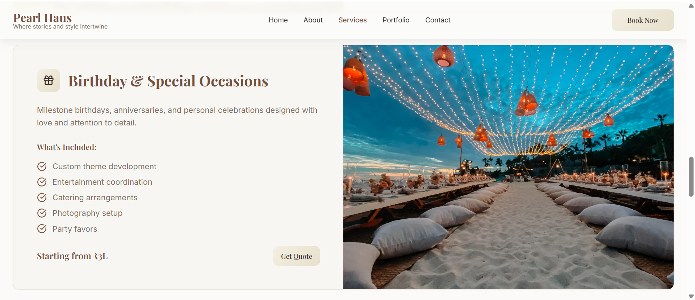
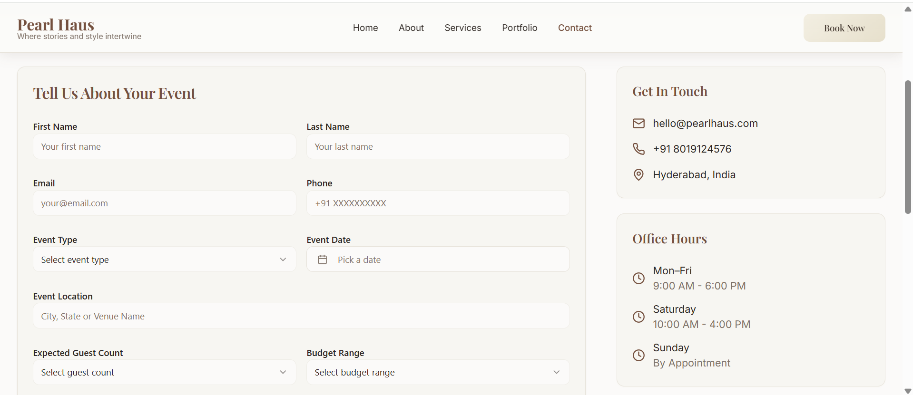

# Event Management Website

## Project Overview

This project is a full-stack Event Management Web Application built using the MERN stack (MongoDB, Express.js, React.js, Node.js). It allows users to book and plan events with various preferences like event type, location, guest count, and budget.

## Features

- Submit inquiries/bookings with event details
- View a responsive user interface built with React
- Backend built using Node.js and Express.js
- MongoDB used for storing booking data
- Clean architecture and organized routing

## Tech Stack

- **Frontend**: React.js, Tailwind CSS
- **Backend**: Node.js, Express.js
- **Database**: MongoDB with Mongoose
- **Hosting**: Can be deployed on platforms like Render, Vercel, or Netlify

## Folder Structure

```
root/
├── backend/
│   ├── models/
│   ├── routes/
│   └── server.js
├── frontend/
│   └── [React App Code]
└── README.md
```

## API Endpoints

- `POST /api/bookings`: Submit a new event inquiry/booking

## Screenshots

### Landing Page


### Services Page


### Testimonials 


### Contact Form



## Getting Started

1. Clone the repository
2. Install dependencies using `npm install` in both frontend and backend
3. Set up a `.env` file in backend with your MongoDB connection string:
   ```bash
   MONGO_URI=your_mongodb_connection_url
   PORT=5000
   ```
4. Run the backend server: `npm run server`
5. Run the frontend app: `npm start` from `/frontend`

## Author

This project was developed by Vaishu Gattu.
